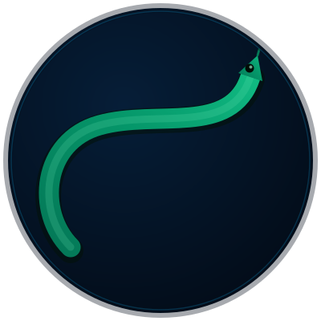

<div align="center">
  
  <h1>IshVenom</h1>
  <p><strong>Snakebite triage, prevention, and real-time biological intelligence<br>running on $80 phones · 6 languages · powered by Gemma 4</strong></p>
  <p>
    <a href="https://opensource.org/licenses/Apache-2.0"></a>
    <a href="https://ai.google.dev/gemma"></a>
    
  </p>
  <p>
    Built by <strong>Kwakye Ishmael Affum (Calyx Ish)</strong> · <a href="https://github.com/calyxish">@calyxish</a> · University of Ghana, Legon<br>
    <em>Gemma 4 Good Hackathon · Kaggle × Google DeepMind · Health &amp; Sciences · Digital Equity · Global Resilience</em>
  </p>
</div>

---

> ### For hackathon judges
>
> | | |
> |---|---|
> | **Live demo (dashboard)** | <https://ishvenom-dashboard.vercel.app> |
> | **Sign in** | `demo@ishvenom.app` · `IshVenom2026!` |
> | **API health** | <https://ishvenom-api.onrender.com/api/v1/health> |
> | **Models** | [HuggingFace · CalyxIsh](https://huggingface.co/CalyxIsh) |
> | **Training data** | [snakes-africa](https://www.kaggle.com/datasets/kwakyeishmael/snakes-africa) · [ishvenom-corpus](https://www.kaggle.com/datasets/kwakyeishmael/ishvenom-corpus) |
>
> One-click web demo + open-licensed models + open training data. No installs required.

---

## The problem

Every year roughly **30,000 people die from snakebites in sub-Saharan Africa**, and an estimated **8,000 more suffer permanent disability**. Most deaths happen in villages hours from the nearest clinic, and most victims receive incorrect first aid — tourniquets, wound incision, suction — that makes outcomes dramatically worse.

The WHO classified snakebite envenoming as a **Neglected Tropical Disease** in 2017 precisely because the data is absent: victims die before they are counted, antivenom stockouts go unreported, and species-distribution maps are decades out of date.

Every tool that exists today assumes cloud connectivity, a GPU-class smartphone, English or French input, and a trained clinician. The people most at risk have none of those things.

## The vision

**IshVenom is not just a snakebite app — it is a real-time biological intelligence and emergency response system powered by Gemma 4.**

#### What it does today
When a community health worker captures and submits an image of a snake, IshVenom uses Gemma 4 — cloud or on-device — to identify the species, assess venom risk, and generate immediate, localized first-aid guidance in six languages. The same model powers a Learn tab for prevention education. The triage path works fully offline on a $80 Android phone via a custom TFLite vision classifier and a fine-tuned Gemma 4 E2B running through `llama.rn`.

#### The data flywheel
Each encounter — properly anonymised — flows into a continental-scale surveillance layer. IshVenom aggregates these reports with environmental context to produce real-time insights for **WHO, ministries of health, and local hospitals**. Hospitals can anticipate antivenom demand instead of running out mid-crisis. Governments can identify outbreak corridors days earlier. Resources move proactively rather than reactively. The shift from delayed paper reporting to live intelligence has the potential to meaningfully reduce mortality and reshape emergency response across the region.

#### The longer arc
Over time, the system maps species distribution, tracks venomous-species migration, and surfaces previously undocumented populations — useful both for biodiversity research and for opening **eco-tourism opportunities** in regions with rare or unique snakes, turning biological knowledge into economic value for local communities. Every photo also contributes — under strict ethical and privacy controls — to iterative Gemma 4 fine-tuning, so the model becomes regionally smarter with every interaction, especially in the underrepresented ecological zones today's commercial models ignore.

IshVenom is built to serve three interconnected goals:

1. **Save lives** with instant, offline-first medical guidance in the user's language.
2. **Strengthen health systems** through real-time epidemiological intelligence for WHO and local hospitals.
3. **Advance global scientific understanding** of snake biodiversity through ethically collected, large-scale data.

This is an AI-powered public-health infrastructure layer for regions where traditional systems do not reach. Built to reduce preventable deaths, empower communities, and transform how the world understands and responds to snakebite risk. Powered by Gemma 4, IshVenom turns isolated incidents into coordinated intelligence — and replaces silence with life-saving information.

## How it works

**Cloud mode** (default, requires internet)
- Camera photograph → Gemma 4 26B A4B MoE identifies the species, classifies venomousness, and generates structured first-aid instructions via the Google AI REST API.
- The same model powers the Learn chat tab for snake-safety education and Q&A.

**On-device mode** (offline, no internet required)
- A custom TFLite vision classifier (EfficientNet-B0, 20 African species) identifies the snake locally in ~50 ms.
- A fine-tuned Gemma 4 E2B LoRA (Q4_K_M GGUF, ~3 GB) generates first-aid text via `llama.rn` — CPU-only, no GPU, no cloud.

Both paths produce the same user experience: species name, venomousness, correct first-aid steps, and a passively-synced encounter record that feeds the WHO-facing surveillance dashboard.

## Why Gemma 4

| | Typical health AI app | IshVenom |
|---|---|---|
| Hardware target | iPhone 13+, Metal GPU | $80 Android, CPU-only, ARM NEON |
| Connectivity | Cloud-required | Cloud-first with offline fallback |
| Model | GPT-4 / Gemini API | Gemma 4 26B cloud + Gemma 4 E2B on-device |
| Languages | English | English, French, Arabic, Hausa, Swahili, Twi |
| Data scarcity | ignored | iNaturalist + GBIF + synthetic SFT pipeline |
| Cost to user | data plan required | zero after install (on-device mode) |

Gemma 4's combination of a capable 26B cloud model and a tiny-but-fine-tunable 2B model makes this dual-mode architecture possible. No other openly-licensed model family covers both ends of the capability–size spectrum.

## Languages

| Language | Primary regions | Speakers |
|---|---|---|
| English | Anglophone Africa, medical professionals | — |
| French | Senegal, Côte d'Ivoire, Mali, DRC, Cameroon | ~140 M |
| Arabic (MSA) | Sudan, Chad, Mauritania, Egypt | ~100 M in Africa |
| Hausa | Northern Nigeria, Niger, Ghana, Cameroon | ~80 M |
| Swahili | Kenya, Tanzania, Uganda, DRC, Rwanda | ~200 M |
| Twi | Ghana | ~9 M |

**Estimated reach: ~700 M Africans across the three highest snakebite-mortality regions.**

## Architecture

```
ishvenom/
├── apps/
│   ├── mobile/          # React Native (Expo) — Gemma 4 cloud + on-device
│   └── dashboard/       # Next.js — WHO-facing surveillance dashboard (Vercel)
├── services/
│   └── api/             # Express + Prisma + Neon Postgres + Google AI Gemma 4 (Render)
├── ml/
│   ├── kaggle/          # Gemma 4 E2B LoRA fine-tuning (Unsloth, T4 x2)
│   ├── train/           # Vision classifier training (EfficientNet → TFLite)
│   └── datasets/        # iNaturalist + GBIF + first-aid SFT pipeline
├── packages/
│   └── shared-types/    # Zod schemas shared across mobile, API, dashboard
└── docs/                # Architecture, data pipeline, deployment guide
```

## Tech stack

**Mobile (React Native / Expo):**
`llama.rn` · Gemma 4 E2B Q4_K_M GGUF · `react-native-fast-tflite` · SQLite (expo-sqlite) · expo-camera · 6-language first-aid corpus

**Backend (Render):**
Node 20 · TypeScript · Express 5 · Prisma · Neon Postgres 16 + PostGIS 3 · Zod · Google AI Gemma 4 for situation-report generation

**Dashboard (Vercel):**
Next.js 14 · Tailwind · next-themes (light/dark) · MapLibre GL JS · Recharts

**ML:**
PyTorch · Hugging Face Transformers · Unsloth · PEFT · `ai-edge-litert` · Kaggle T4 × 2

## Model training summary

| Model | Base | Method | Data | Notes |
|---|---|---|---|---|
| Vision classifier | EfficientNet-B0 | Fine-tune → ONNX → TFLite export | ~1,500 iNaturalist images, 20 species | ImageNet-normalised, val_top3 ≥ 85% |
| IshVenom Gemma 4 E2B | `google/gemma-4-e2b-it` | LoRA rank 16, alpha 32 | 5,000 first-aid SFT examples (EN + FR) | Final loss 0.0224 |

Trained on Kaggle (T4 × 2, 16 GB VRAM). LoRA merged and quantized to Q4_K_M via `ggml-org/gguf-my-repo` HuggingFace Space.

## Deployment & artifacts

| Resource | Where | URL |
|---|---|---|
| **Dashboard** (WHO surveillance UI) | Vercel | <https://ishvenom-dashboard.vercel.app> |
| **API** (encounter sync, sit-reports) | Render | <https://ishvenom-api.onrender.com> |
| **Database** | Neon Postgres 16 + PostGIS 3 | — |
| **Vision classifier** (TFLite, EfficientNet-B0) | HuggingFace | [CalyxIsh/ishvenom-vision-classifier](https://huggingface.co/CalyxIsh/ishvenom-vision-classifier) |
| **Gemma 4 E2B LoRA** (merged FP16) | HuggingFace | [CalyxIsh/ishvenom-gemma-e2b-merged](https://huggingface.co/CalyxIsh/ishvenom-gemma-e2b-merged) |
| **Gemma 4 E2B LoRA** (Q4_K_M GGUF for `llama.rn`) | HuggingFace | [CalyxIsh/ishvenom-gemma-e2b-merged-Q4_K_M-GGUF](https://huggingface.co/CalyxIsh/ishvenom-gemma-e2b-merged-Q4_K_M-GGUF) |
| **Training corpus** (5,000 first-aid SFT examples) | Kaggle | [kwakyeishmael/ishvenom-corpus](https://www.kaggle.com/datasets/kwakyeishmael/ishvenom-corpus) |
| **Image splits** (20 African species) | Kaggle | [kwakyeishmael/snakes-africa](https://www.kaggle.com/datasets/kwakyeishmael/snakes-africa) |

See [`docs/DEPLOYMENT.md`](./docs/DEPLOYMENT.md) for the full setup guide.

## Running locally

```bash
git clone https://github.com/calyxish/ishvenom.git
cd ishvenom
pnpm install

# Backend
cp services/api/.env.example services/api/.env
# fill in DATABASE_URL (Neon), SESSION_SECRET, GOOGLE_AI_KEY for sit-reports
pnpm --filter @ishvenom/api prisma:generate
pnpm --filter @ishvenom/api dev

# Dashboard
cp apps/dashboard/.env.example apps/dashboard/.env.local
# NEXT_PUBLIC_API_BASE=http://localhost:4000/api/v1
pnpm --filter @ishvenom/dashboard dev
# Open http://localhost:3000 → sign in with demo@ishvenom.app / IshVenom2026!

# Mobile
cp apps/mobile/.env.example apps/mobile/.env
# EXPO_PUBLIC_GOOGLE_AI_KEY from https://aistudio.google.com
pnpm --filter ishvenom dev
```

Want to skip training entirely? See [`ml/kaggle/README.md`](./ml/kaggle/README.md) — the section at the top points to all the pre-built models on HuggingFace.

## License

Apache 2.0 — see [LICENSE](./LICENSE). Same license as Gemma 4 itself. All models and datasets are also released under Apache 2.0 so any health agency, university, or NGO can build on top.

## Acknowledgements

- Google DeepMind for Gemma 4 and the Gemma 4 Good Hackathon
- WHO Neglected Tropical Diseases programme
- iNaturalist and GBIF for open biodiversity data
- The community health workers across West Africa whose work this is meant to support

---

**Gemma 4 Good Hackathon · Kaggle × Google DeepMind · Submitted May 18, 2026**
